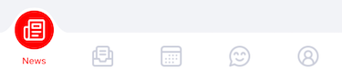

# FluidTabBarController

[](https://app.bitrise.io/app/e6562597b7f7f0dd/status.svg?token=YMyR8VoBWCSMQ5FHLpRfyw&branch=feature/bitrise)
[](https://cocoapods.org/pods/FluidTabBarController)
[](https://cocoapods.org/pods/FluidTabBarController)
[](https://cocoapods.org/pods/FluidTabBarController)

<p align="left">
  
</p>

## Example

To run the example project, clone the repo, and run `pod install` from the Example directory first.

## Requirements

## Installation
FluidTabBarController doesn't contain any external dependencies.

It is available through [CocoaPods](https://cocoapods.org). To install
it, simply add the following line to your Podfile:

```ruby
pod 'FluidTabBarController'
```

## Usage

To use FluidTabBarController in your application first create the `FluidTabBarController` instance:    
```
let tabBarController = FluidTabBarController()
```   
Then create items for all of view controllers you want to add to the tab bar controller. You must use `FluidTabBarItem` to make animations work.

```
let mainViewController = MainViewController()
let mainViewControllerItem = FluidTabBarItem(title: "Main", image: UIImage(named: "main"), tag: 0)
mainViewController.tabBarItem = mainViewControllerItem
```
Create an array of your view controllers and assign it to the tab bar's `viewControllers` property.  
```
tabBarController.viewControllers = [mainViewController]
```


## Customization
You can change the color of selected item's text by setting the tint color of the tab bar.
`tabBarController.tabBar.tintColor = UIColor.red`

<p align="left">
  
</p>

You can also change the color of icons by specifying `imageColor` and `highlightImageColor` or text color by modifying `textColor` and `highlightTextColor`.

## Author

Hubert Kuczyński, hubert.kuczynski@10clouds.com

## License

FluidTabBarController is available under the MIT license. See the LICENSE file for more info.
